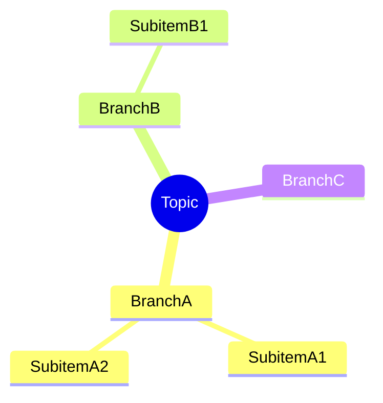
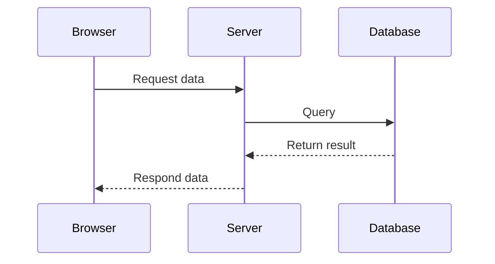
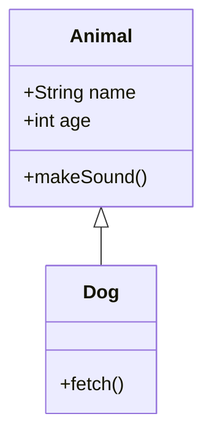
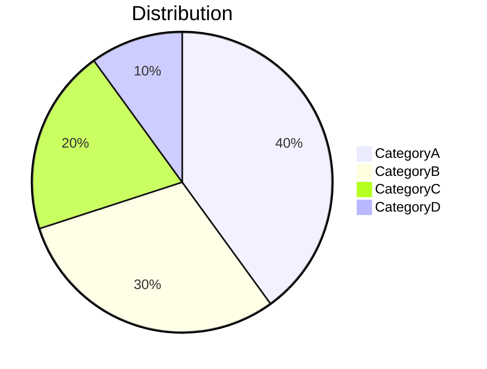
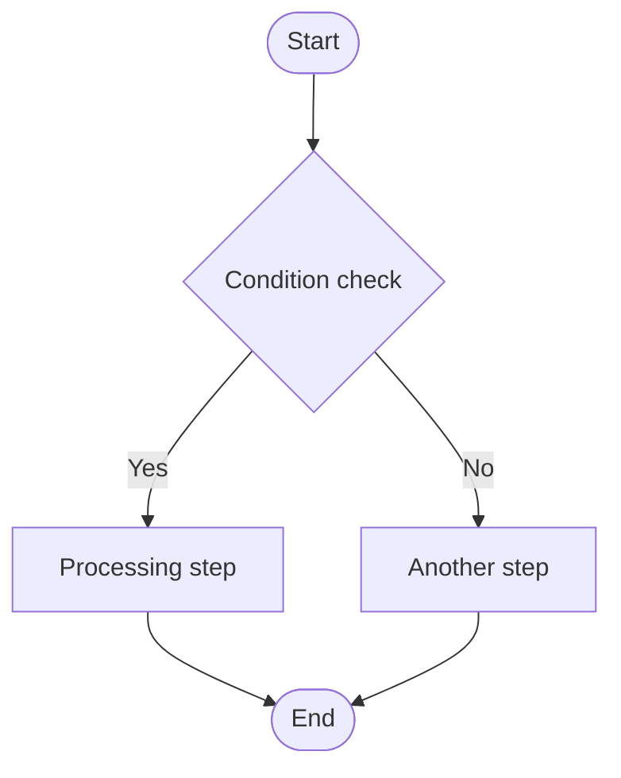
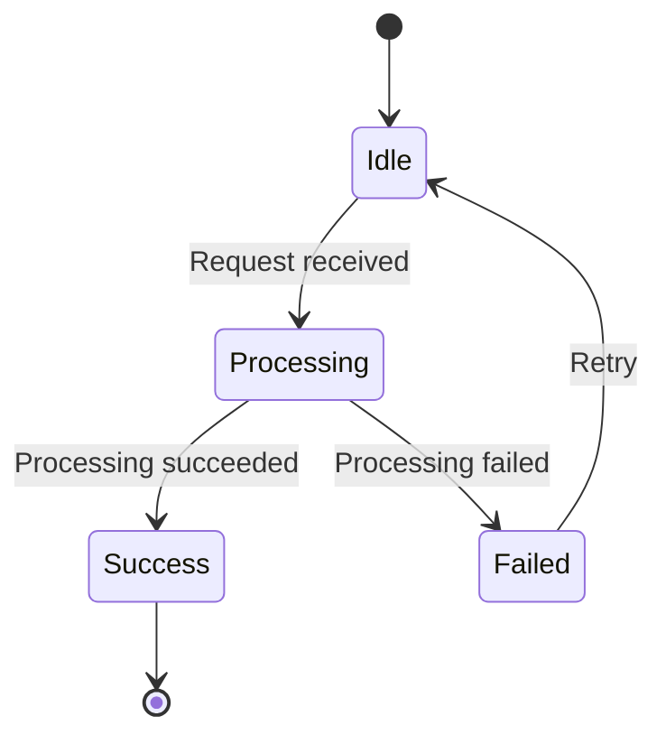

# Mermaid Diagram Path

This scenario is mutually exclusive with the DSL path.

| | DSL Path | Mermaid Path |
|---|---|---|
| Intermediate format | JSON (WBDocument) | Mermaid text (.mmd file) |
| Layout control | Precise control (x/y coordinates, Flex) | Automatic layout by parser-kit |
| Visual customization | Fully controllable (color, font size, corner radius, etc.) | Limited (Mermaid syntax) |
| Reference modules | elements/ + corresponding scene | This file only |

## Applicable Conditions

Use when any of the following conditions is met:
- The user explicitly requests "use Mermaid" or "output Mermaid"
- The user directly pastes Mermaid syntax text
- The diagram type is a mind map, sequence diagram, class diagram, or pie chart (automatic routing)

## Mindmap

## Sequence Diagram

Message types:
- `->>` solid arrow (synchronous request)
- `-->>` dashed arrow (response/asynchronous)
- `-x` arrow with x (failure)

## Class Diagram

## Pie Chart

## Flowchart

> [!WARNING]
> **The Mermaid path is not recommended for flowcharts!**
> Flowcharts with complex branches, composite nodes, and high-fidelity card styles should preferentially use the **DSL path** (see `scenes/flowchart.md`). Use this path only when the user explicitly provides Mermaid code, or when the scenario itself is a minimal text flow.

Applicable to: minimal text-node business flow judgment.

### Constraints and Specifications

- **Node text ≤ 8 characters** (must be abbreviated if exceeded; add a legend explanation when necessary)
- Decision nodes (diamonds) should only contain condition keywords, not long descriptions
- Number of steps ≤ 12 (merge steps or split into subflows if exceeded)
- Follow standard flowchart symbols: use stadium shape or circle `A([开始])` for start/end, diamond `B{判断}` for decisions, rectangle `C[步骤]` for steps

### Syntax Reference

Direction: `TD` (top to bottom), `LR` (left to right), `BT` (bottom to top), `RL` (right to left)

Node shapes: `A[矩形]`, `A(圆角)`, `A{菱形}`, `A((圆形))`, `A([体育场])`, `A[[子程序]]`

Connections: `-->` (solid line), `-.->` (dashed line), `==>` (thick line), `-->|标签|` (with label)

## State Diagram

## Other Supported Diagram Types

- **Gantt chart**: `gantt`
- **ER diagram**: `erDiagram`
- **Git branch diagram**: `gitGraph`

## Notes

- Output plain Mermaid text, not JSON; do not mix with DSL
- When node text contains special characters, wrap it in double quotes: `A["包含(括号)的文字"]`
- `subgraph` is used for logical grouping
- Mermaid's flowchart styles are relatively basic, and complex layouts cannot be nested inside nodes; for complex flows, preferentially use DSL (see `scenes/flowchart.md`), and use Mermaid only for minimal text flows or when the user explicitly provides Mermaid code.
